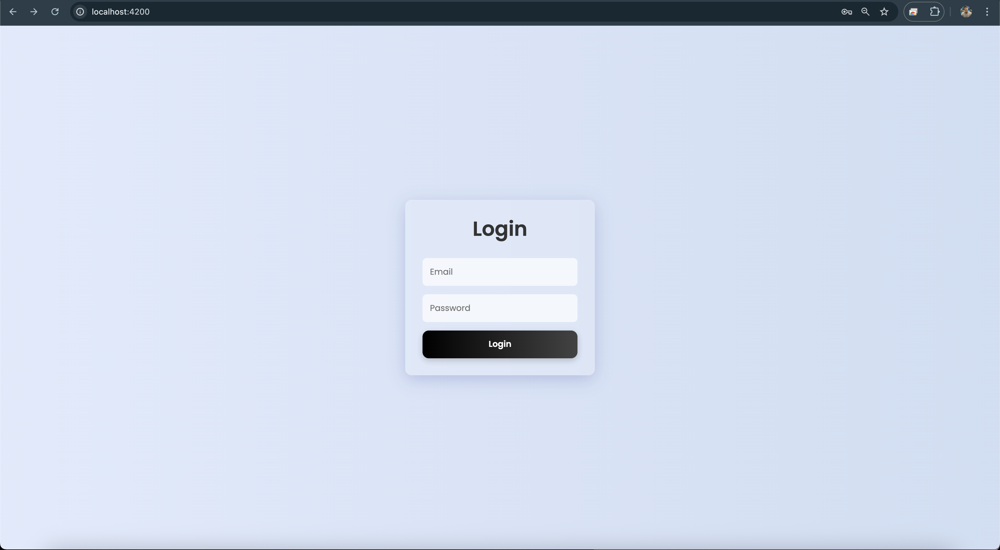
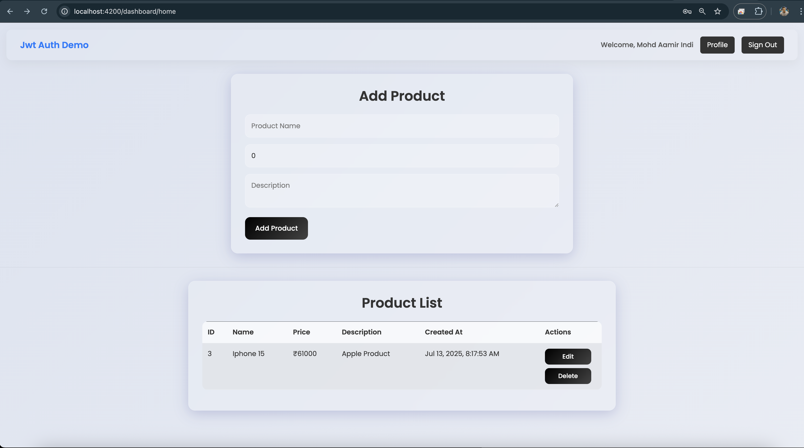

# 🔐 JWT Auth + Product Management Full Stack App

This project is a complete end-to-end full stack application using **.NET Core Web API** and **Angular**, implementing secure authentication using JWT and managing product data. It covers all 4 tasks provided in the assignment.

---

## 📁 Folder Structure

---

## ✅ Tasks Covered

| Task | Description |
|------|-------------|
| **1** | API authenticates Angular client using JWT |
| **2** | Web app (Angular) saves & retrieves product info via API |
| **3** | Angular client uses RxJS `BehaviorSubject` to reflect login state |
| **4** | Web app authenticates user & secures API using JWT |

---

## 🧰 Tech Stack

- **Backend:** ASP.NET Core 7 Web API
- **Frontend:** Angular 17 (Standalone Components)
- **Auth:** JWT (JSON Web Token)
- **Database:** SQL Server (via Entity Framework Core)
- **Security:** Role-based Authorization (Admin only access to Delete API)
- **UI:** Glassmorphism-styled login & dashboard

---

## 🚀 How to Run

### 1️⃣ Backend (ASP.NET Core)

```bash
cd Task1_JWT_API/JwtAuthDemo

# Restore dependencies
dotnet restore

# Apply DB Migrations
dotnet ef database update

# Run the API
dotnet watch run

cd Task1_JWT_API/jwt-angular-client

# Install dependencies
npm install

# Run Angular app
ng serve

```

## 📷 Screenshots

### 🔐 Login Page


---

### 🛒 Product Dashboard



👇 Features

🔐 Authentication
	•	JWT-based login
	•	Token stored in localStorage
	•	AuthGuard to protect routes

📦 Product Management
	•	Add / List / Edit / Delete Products
	•	Delete restricted to Admin role only
	•	Products displayed in a styled table
	•	API secured using [Authorize]

👤 Profile Page
	•	Displays logged-in user info
	•	Accessible only when logged in

⸻

🔄 Interceptor

Automatically attaches JWT token from localStorage to all protected API requests using Angular HttpInterceptor.

⸻

📌 Notes
	•	Admins can Delete products.
	•	UI is styled using custom CSS for glassmorphism.
	•	Angular uses standalone components and modern routing.
	•	Refresh token logic can be added if needed in future.

⸻

🧾 License

MIT License. Feel free to use or extend for your own projects.

CORS Policy 

```bash
builder.Services.AddCors(options =>
{
    options.AddPolicy("CorsPolicy", policy =>
    {
        policy.WithOrigins("http://localhost:4200")
              .AllowAnyHeader()
              .AllowAnyMethod()
              .AllowCredentials();
    });
});
```
